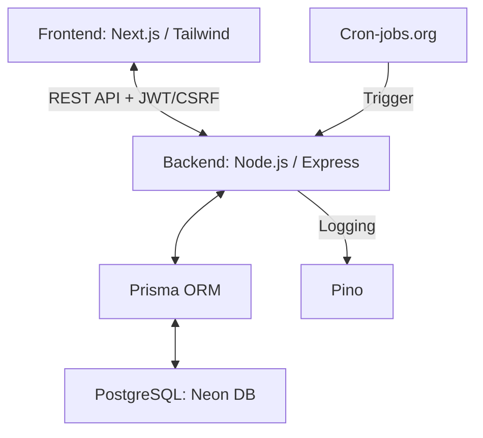

# Academic Dashboard (Grade Proxy)


A high-integrity Academic Risk Management system designed to model grade trajectories, track deadline collisions, and simulate performance outcomes using a custom rule engine.

## What This Project Demonstrates
- **Complex Logic Modeling:** Implementation of late submission penalties, deadline collision detection, and multi-weighted grade calculations.
- **Predictive Simulation:** A "Grade Simulator" engine allowing users to project final outcomes using optimistic placeholders and target scores.
- **Full-Stack Type Safety:** Unified validation using Zod across a decoupled Node.js/Express backend and Next.js frontend.
- **Robust Testing Suite:** Comprehensive coverage using Jest and Supertest for critical business logic (grade formulas) and REST endpoints.
- **Automated Workflows:** Scheduled cron jobs for notification dispatch and background status derivation.

Built with **Next.js**, **Express**, **Prisma**, and **PostgreSQL**.

---

## 1. The Challenge of Academic Modeling

Tracking a degree is more complex than a standard TODO list. It involves:
- **Nested Weighting:** Grades that contribute differently to a total score based on varying scales.
- **Temporal Risks:** Deadline "collisions" where multiple high-weight items overlap, requiring urgency-based prioritization.
- **Policy Variance:** Dynamic calculation of scores based on specific late submission percentage decays.

This project moves beyond CRUD by implementing a system that treats "Status" and "Grade" as derived values based on time-sensitive rules and user-defined targets.

## 2. Core Features

### Risk & Grade Management
- **Grade Simulator:** Input hypothetical scores to visualize "Maximum Potential Grade" vs. "Current Grade."
- **Collision Tracker:** Visual indicators for overlapping deadlines and assessment clusters.
- **Dynamic Grading Engine:** Support for late submission logic and improper weight warnings (e.g., total weight $\neq$ 100%).

### Dashboard & UI
- **Course-Centric Views:** Per-course breakdowns with horizontal progress visualizations for grade tracking.
- **Urgency-Based Sorting:** A global "Action Items" list sorted by a custom urgency algorithm (Status > Due Date > Weight).

### Security & Auth
- **Secure Identity:** JWT-based authentication via Passport.js with Google OAuth integration and CSRF protection.
- **JWT Protection:** Considered use of HS256 algorithm specification to prevent "algorithm confusion attacks."
- **CSRF Strategy:** Upgraded step-by-step from base passport strategy to Double-Submit Cookie pattern (HttpOnly cookie + Header token).
- **Rate Limiting:** Implemented rate limiting on the Google OAuth callback.
- **Token Strategy:** Shifted from cookies to Authorization Headers to support cross-domain communication.

## 3. High-Level Architecture

The system utilizes a decoupled architecture to separate the concerns of the **Simulation Engine** from the **Data Persistence Layer**.



## 4. Technical Implementation: The Rules Engine

### Late Submission Logic
The system calculates final scores by intercepting the `submittedAt` timestamp against the `dueDate`, applying a decay function defined by the course's late policy:

$$FinalScore = RawScore \times (1 - PenaltyPercentage)$$

### Dynamic Penalties: 
The late penalty value was calculated dynamically using a time-based decay function:

$$PenaltyPercentage = DaysLate \times Percentage$$

### Weight Validation
To prevent "Improper Grade Percentages," the system implements a Zod-backed validation layer that flags courses where the sum of item weights $\neq 100\%$. The UI displays warning icons while allowing dynamic changes to keep the user informed without blocking workflow.

### Predictive Analytics:

- **Required Score Calculation:** Beyond simple simulation, the system features a "Goal" engine (POST /goal). Users can input a target final grade, and the system uses the calculateRequiredScores() domain function to reverse-engineer the minimum marks needed on remaining assessments.
- **Urgency Heat Bar:** A custom algorithm (rankAssessmentsByUrgency) scores assessments based on a weighted matrix of deadline proximity, point value, and current status.

### Layered Testing Strategy
To ensure the integrity of academic calculations, the system employs a tiered testing architecture:
* **Domain Tests:** Pure business logic verification for grade formulas and late penalty decay.
* **Service Tests:** Orchestration and integration between logic handlers and Prisma repositories.
* **Controller Tests:** Validation of HTTP contracts, request/response handling, and Zod schema enforcement.

### Precision & Safety
- **Decimal Precision:** Using Prisma's `Decimal` type to avoid floating-point errors in GPA calculations.
- **Integrity Constraints:** While the backend handles validation, the system is designed to support **DB-level triggers** as an optional safety layer for weight-sum enforcement (Weight total = 100%).

## 5. Key Engineering Challenge: The "Ghost" Database Outage

### The Issue
During deployment within a Dockerized environment, the Node.js backend intermittently threw `P1001: Can't reach database server` errors. Paradoxically, Prisma’s `$connect()` calls were successful, and TCP connectivity to the Neon PostgreSQL instance was confirmed.

### The Investigation
I performed a multi-layer trace across the containerized stack:
1.  Verified container egress and DNS resolution within the Docker bridge network.
2.  Confirmed SSL/TLS compatibility with the Neon connection pooler.
3.  **The Breakthrough:** By introspecting the underlying `pg` Pool object at runtime, I discovered that the `DATABASE_URL` contained literal quotation marks.

### The Root Cause
Unlike shell or `.env` parsers, Docker environment configuration does not automatically strip quotes. This caused the PostgreSQL driver to misparse the connection string at the query execution layer, despite the initial connection handshake appearing valid.

### The Resolution
Corrected the Docker environment variable formatting to remove extraneous quotes. This experience hardened my approach to **environment parity** and the importance of validating parsed configuration over raw output.

## 6. Tech Stack

- **Frontend:** Next.js, TypeScript, Tailwind CSS, TanStack Query
- **Backend:** Node.js, Express, REST API, Prisma
- **Database:** PostgreSQL (Neon)
- **Security:** Passport.js (JWT), Zod (Validation), CSRF protection (disabled)
- **Infrastructure:** Docker, GitHub Actions (CI/CD), Cron-jobs.org for scheduled tasks
- **Logging:** Pino for structured, high-performance logging

## 7. Resource Constraints & Limits

To maintain a responsive experience and ensure data integrity, the system enforces the following limits:

| Resource / Field          | Limit/Constraint  |
|---------------------------|-------------------|
| Active Courses            | 50                |
| Items per Course          | 100               |
| Total Course Items        | 5000              |
| Text length (Description) | 250 chars         |
| Item Status               | Enum-based checks |
| Score Precision           | 2 Decimal Points  |

**CI/CD Maturity:** Branch protection is present, requiring status checks and automated coverage badges for the backend.

### 7b. Security Pivot: From Cookies to Authorization Headers

**The Challenge:** Initially, the system utilized HttpOnly cookies for JWT storage to benefit from native CSRF protection. While this worked in local development, the cross-domain nature of the deployed environment (Vercel frontend vs. Render backend) caused modern browsers to drop third-party cookies by default due to `SameSite=None; Secure` requirements on non-identical top-level domains.

**The Decision:** To avoid the overhead of purchasing a custom domain to unify the origins, I performed a strategic pivot to an **Authorization Header** (Bearer Token) strategy. 

**The Trade-off:** - **Pros:** Restored full cross-domain functionality; eliminated CORS preflight redirect issues; simplified frontend service layer.
- **Cons:** Explicitly accepted the loss of built-in CSRF protection (as tokens are now handled by the client-side JS rather than the browser's cookie jar).
- **Mitigation:** Retained strict Zod validation on all incoming requests and enforced HTTPS-only communication to ensure token transit security.

This decision reflects a pragmatic approach to deployment constraints—prioritizing a functional, accessible system while maintaining transparency about the security posture.

## 8. Setup & Installation

1.  **Clone & Install:**
    ```bash
    git clone [repo-url]
    npm install
    ```
2.  **Environment:** Provide your Neon DB string, Google OAuth credentials, and JWT secret.
3.  **Database Setup:**
    ```bash
    npx prisma migrate dev
    npx prisma db seed
    ```
4.  **Run Suite:**
    - **Dev:** `npm run dev` (Frontend and Backend)
    - **Tests:** `npm run test`

## 9. Architectural Discussion Areas

If reviewing this project, interesting areas for discussion include:
- **Offline Reliability:** Strategies for caching grade simulations in low-connectivity environments using localStorage or sessionStorage.
- **Data Privacy:** Handling personal information when scaling to multiple users and institutions.
- **API Extensibility:** Implementing expandable resources (e.g., `GET /assessments/:id?expand=course,urgency`) to reduce round-trips in complex dashboard views.
- **Calculation Scaling:** Moving from client-side simulation to a server-side "Grading Engine" for complex campus-wide formulas.
- **Notification Scaling:** Transitioning from cron-based polling to a robust message queue (e.g. BullMQ) for real-time risk alerts.